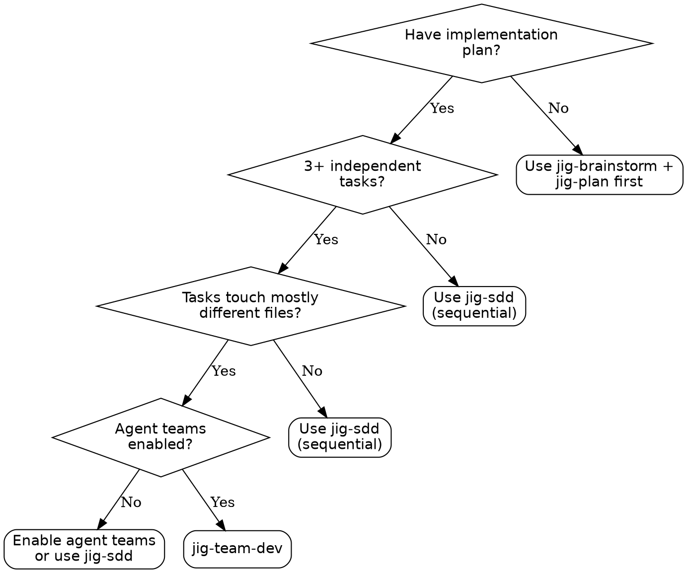
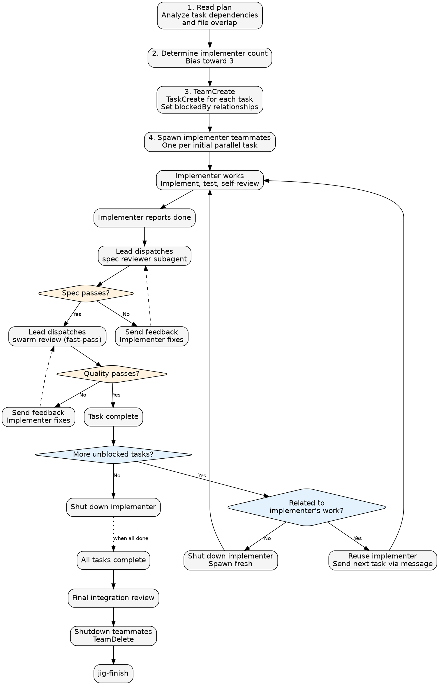

# Team-Driven Development

Execute implementation plans by spawning implementer teammates that work in parallel, each in their own split pane. The team lead orchestrates a staggered review pipeline — as each implementer finishes, the lead dispatches spec compliance and code quality reviewer subagents. Quality gates are enforced: no task is complete until both reviews pass.

**Core principle:** Parallel implementation via agent teams + two-stage review gates = fast iteration with high quality.

## When to Use



### Comparison

| | jig-sdd | Parallel Agents | jig-team-dev |
|---|---|---|---|
| **Execution** | Sequential, one task at a time | Parallel, fire-and-forget | Parallel, staggered pipeline |
| **Quality Gates** | Spec + quality review | None | Spec + quality review |
| **Visibility** | Single session | Background subagents | Split panes, interactive |
| **Feedback Loop** | Synchronous within session | None | Bidirectional via SendMessage |
| **Best For** | Sequential or coupled tasks | Quick parallel research | Independent tasks with quality needs |
| **Token Cost** | Lowest | Medium | Highest (persistent sessions) |

## Prerequisites

- **Agent teams enabled**: `CLAUDE_CODE_EXPERIMENTAL_AGENT_TEAMS: "1"` in settings
- **tmux teammate mode**: `teammateMode: "tmux"` in `~/.claude/settings.json` (recommended for split panes)
- **Running inside tmux**: Launch via `tmux -CC` in iTerm2 or `tmux new -s claude` then `claude`
- **Implementation plan**: A numbered plan with tasks (from `jig-plan`)

### Quick Setup

**1. Enable agent teams** — add to your project's `.claude/settings.json`:
```json
{
  "env": {
    "CLAUDE_CODE_EXPERIMENTAL_AGENT_TEAMS": "1"
  }
}
```

**2. Enable tmux teammate mode** — add to your user settings at `~/.claude/settings.json`:
```json
{
  "teammateMode": "tmux"
}
```

**3. Launch Claude inside tmux**:
```bash
# iTerm2 (recommended — gives you native iTerm2 tabs/panes)
tmux -CC

# Standard terminal
tmux new -s claude
```
Then run `claude` from inside the tmux session. Teammates appear as split panes automatically.

**4. Have an implementation plan** — use `jig-plan` to generate one, or write one manually.

## The Process



## Prompt Templates

| Template | Purpose | Invocation |
|----------|---------|------------|
| `./implementer-prompt.md` | Spawn an implementer teammate | Task tool with `team_name` |
| `./spec-reviewer-prompt.md` | Dispatch spec compliance reviewer | Subagent (not teammate) |
| `jig-review` skill | Dispatch swarm quality review (fast-pass tier) | Subagent via skill pipeline |
| `./lead-playbook.md` | Lead's orchestration decision logic | Reference for the lead |

## Key Design Decisions

### Staggered Pipeline
Reviews happen as implementers finish — no waiting for all to complete. Multiple reviews can run in parallel since they are read-only.

### Implementers Wait for Review
An implementer does NOT start their next task until both reviews pass on their current task. This prevents messy context switches when review feedback arrives.

### Lead Dispatches All Reviews
Reviewers are subagents (not teammates). They report to the lead, who decides next steps. This keeps the lead as the single quality gatekeeper.

### Dynamic Implementer Count

| Independent Task Count | Recommended Implementers |
|------------------------|--------------------------|
| 2 | 2 |
| 3-4 | 3 |
| 5-6 | 4-5 |
| 7+ | 5-6 (cap at 6) |

Bias toward 3. Scale up when tasks are truly independent. Scale down when overlap is high.

### Reuse vs Fresh Spawn
- **Related task** (same module/directory) — reuse the teammate. Existing context helps.
- **Unrelated task** (different area) — shut down and spawn fresh. Avoids context pollution.

### File Conflict Prevention
The lead groups tasks by file surface area before spawning. Tasks touching the same files never run in parallel — they use `blockedBy` dependencies instead.

## Red Flags

**Never:**
- Dispatch multiple implementers to tasks touching the same files
- Skip reviews (spec OR quality) for any task
- Let implementers start next task before current review passes
- Spawn more implementers than independent tasks
- Let implementers dispatch their own reviews (lead's job)
- Start quality review before spec compliance passes
- Move to final review while any task has open review issues

**If implementer asks questions:**
- Answer via SendMessage with the specific context they need
- Do not leave them waiting — quick turnaround keeps the pipeline moving

**If reviewer finds issues:**
- Lead sends specific feedback to implementer via SendMessage
- Implementer fixes in-place and reports back
- Lead re-dispatches the same reviewer type
- Repeat until approved — only then proceed to next stage

**If implementer gets stuck:**
- Check their pane directly
- Send guidance via SendMessage
- Last resort: shut down and spawn replacement with clearer instructions

## Integration

**Required workflow (in order):**
1. **jig-brainstorm** — design the feature
2. **jig-plan** — create the numbered implementation plan
3. **jig-team-dev** — execute in parallel with quality gates
4. **jig-finish** — merge/PR when all tasks pass

**Used during orchestration:**
- **jig-verify** — before marking the effort done
- **jig-review** — swarm review at fast-pass tier per task

**Implementer teammates use:**
- **jig-tdd** — TDD for each task
- Domain skills from the team's extensions

**Alternative workflows:**

| Situation | Use Instead |
|-----------|-------------|
| Fewer than 3 independent tasks | **jig-sdd** |
| Tasks share many files | **jig-sdd** |
| Agent teams not enabled | **jig-sdd** |

## Limitations

- Requires agent teams enabled (experimental feature)
- Split panes require tmux or iTerm2
- Tasks must touch different files to parallelize safely
- Higher token cost than jig-sdd (multiple persistent sessions)
- One team per session — clean up before starting another
- Teammates cannot spawn their own teams
- Heavily coupled plans may degrade to near-sequential execution
